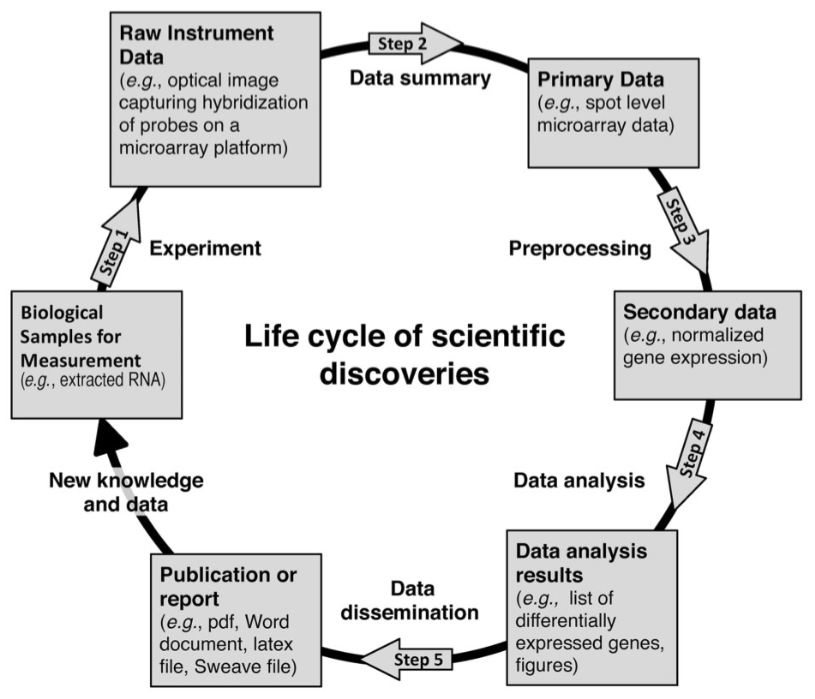

```{r, cache=FALSE, echo=FALSE}
# Set some global knitr options
library("knitr")
opts_chunk$set(tidy = TRUE, tidy.opts = list(blank = FALSE, width.cutoff = 120), cache = TRUE, autodep = TRUE, messages = FALSE)
```


## Motivation

- New high throughput technologies including gene and protein expression microarrays, flow and mass cytometry, next generation sequencing, etc.

- Experiments and protocols have become increasingly complex &rarr; can be very sensitive to specific settings

- Generate large datasets
    - Unique challenges (large p, small n)
    - Analyses of such data often require the use of many specialized tools

- Many challenges for data generation to analysis

## Retraction, retraction, retraction ...

<iframe src="http://retractionwatch.com/category/by-author/anil-potti-retractions/"></iframe>

## Confounding?

<iframe src="http://f1000research.com/articles/4-121/v1"></iframe>

## Outline

- Discuss some of the pitfalls encountered in “omics” data generation and analysis
    - Many of these are not new but have been amplified with omics data due to technical variation, high dimensionality, etc.
- Presents some strategies and guidelines that researchers should follow when undertaking such studies
- Use case: Gene expression analysis (microarray and RNA-seq)
- Example code will always be presented or made available (in the Rmd file)

## Short review on technologies

- Review Molecular [Biology 101 slides](./Biology_basics.html)
- Review [Microarray slides](./Microarrays.html) and [RNA-seq slides](https://www.biostat.wisc.edu/bmi776/lectures/rnaseq.pdf)

# Pitfall 1: Multiple testing!

## Differential gene expression

Let's assume that we are working with gene expression microarray data that have been normalized (and probes summarized).


Condition | 1 | -- | 1 | 2 | -- | 2 |
---|---|---|---|---|---|--- |
Replicate | 1 | -- | $R_1$ | 1 | -- | $R_2$ | 
Gene 1 | x | -- | x | y | -- | y |
Gene 2 | x | -- | x | y | -- | y |
Gene G | x | -- | x | y | -- | y |


 Our goal here is to find genes that are _differentially expressed_ between the two conditions. 

## Goal


**Note:** Here I will focus on oligo based arrays

- For each gene: Is gene $g$ differentially expressed between the two conditions?
- Is the mean expression level under condition 1 different from the mean expression level under condition 2?
- Test an hypothesis about the equality of the means of the two distributions

## Two-sample t-tests


- For each gene, are the mean log expression values equal?

Welch's t-test: $$t_g=(\bar{y}_{1g}-\bar{y}_{2g})/\sqrt{s^2_{1g}/R_1+s^2_{2g}/R_2}$$

If the means are equal, $t$ approximately follows a t-distribution with $R_1 + R_2 - 1$ degrees of freedom.

p-value $p = 2\cdot P(|t_{R_1+R_2-1}| > |t_g|)$

## Error rates

Called/Truth | Differentially expressed | Not differentially expressed|
---|---|--- |
Differentially expressed | 1-$\beta$ | $\alpha$ (Type I error)|
Not differentially expressed | $\beta$ (Type II error) | 1-$\alpha$|


## Multiple testing

- Fix the type I error rate (0.05)
- Minimize the type II
- This is what we do for each gene with a p-value cut off of 0.05
- Problem?
    - Look at many genes!

## Multiple testing

- 1000 t-tests, all null hypothesis are true ($\mu_1=\mu_2$) 
    - For one test, Pr of making an error is 0.05.
    - For 1000 tests, Pr of making at least one error is 1-(1-0.05)^1000 which is `r 1-(1-0.05)^1000`!

## Multiple testing


- The error probability is much greater when looking at many genes!
- We look at $G$ genes with $G$ very large! For each gene, $\alpha$ error probability
- Multiple testing is used to control an overall measure of error (FWER, FDR)

## Family Wise Error Rate


Controls the probability of making at least one type I error 


**Example:** Bonferroni multiple adjustment

$$\tilde p_g = G \cdot p_g$$

If $\tilde p_g \le \alpha$ then $FWER \le \alpha$


Many other (more powerful) FWER procedures exist (Holm's step-down, Hochberg's step-up).

## False Discovery Rate

Proportion of false positive among the genes called DE

First procedure introduced by Benjamini and Hochberg (1995)

- Order the p-values $p_{(1)} \le \dots \le p_{(g)} \le \dots \le p_{(G)}$

Let $k$ be the largest $g$ such that $p_{(g)} \le g/G\alpha$ then the 

FDR is controlled at $\alpha$

- Hypothesis need to be independent!
- Alternative approaches exist for dealing with the dependence at the cost of losing 
some power when the test are in fact independent. 

## False Discovery Rate

```{r, eval=TRUE, fig.height=3}
library(ggplot2)
p <- rbeta(1000,.1,.1)
p_sorted <- sort(p)
qplot(1:1000, p_sorted) + geom_abline(intercept = 0, slope = 0.05 / 1000) +
  xlim(c(0, 500)) + ylim(c(0, .1))
```

- Look at the `p.adjust` function in R!

## Recommended additional reading

- Benjamini, Yoav, and Daniel Yekutieli. 2001. “The Control of the False Discovery Rate in Multiple Testing under Dependency.” Annals of Statistics 29 (4). Institute of Mathematical Statistics: 1165–88.

- Gavrilov, Yulia, Yoav Benjamini, and Sanat K. Sarkar. 2009. “An Adaptive Step-down Procedure with Proven FDR Control under Independence.” Annals of Statistics 37 (2). Institute of Mathematical Statistics: 619–29.

- Storey, John D. 2002. “A Direct Approach to False Discovery Rates.” Journal of the Royal Statistical Society. Series B, Statistical Methodology 64 (3). Blackwell Publishers: 479–98.


# Pitfall 2: Small sample size!

## t-test - revisited

Microarray (and generally speaking) omics experiments are expensive, and as such the number of replicates is usually small. These can lead to the following issues:

- The test statistic is not normally distributed
- The variance estimates are noisy, with thousands of test, some of the estimated variances can be extremely small!


## Modified t-test


- Small variance problem: 

Regularized t-test: $$t_g=(\bar{y}_{1g}-\bar{y}_{2g})/\sqrt{s^2_{1g}/R_1+s^2_{2g}/R_2+c}$$

where $c$ is a positive constant used to regularize the variance estimate (e.g. 95% of all standard deviations $S_g$)

- Small sample size and distributional assumption:

Estimate the null distribution by permutation. Under the assumption of no differential expression we can permute the columns of the data matrix. 

This is the main idea behind SAM. 

Tusher, V. G., Tibshirani, R., & Chu, G. (2001). Significance analysis of microarrays applied to the ionizing radiation response. Proceedings of the National Academy of Sciences of the United States of America, 98(9), 5116–5121. doi:10.1073/pnas.091062498


## Linear Models for Microarray Data - LIMMA


LIMMA is popular Bioconductor package for the analysis of microarray data that provides a flexible linear modeling framework for assessing differential expression.

Smyth, G. K. (2004). Linear models and empirical bayes methods for assessing differential expression in microarray experiments. Statistical Applications in Genetics and Molecular Biology, 3(1), Article3. doi:10.2202/1544-6115.1027

## Linear Models for Microarray Data - LIMMA 


Let $\mathbf{y}^T_g=(y_{g1}, y_{g2},\dots, y_{gn})$ be the expression vector of gene $g$. 
The response would be log-ratios for 2-color microarrays or log-intensities for single-channel data. 

Smyth (2004) assumes that the mean expression value of $\mathbf{y}_g$ can be described through a linear model:

$$ \mathbb{E}(\mathbf{y}_g)=\mathbf{X}\boldsymbol{\alpha}_g$$ 

where $\mathbf{X}$ is a full column rank design matrix and $\boldsymbol{\alpha}_g$ is a coefficient vector. 

## Linear Models for Microarray Data - LIMMA 

It is futher assume that 

$$\mathrm{var}(\mathbf{y}_g)=\mathbf{W}_g\sigma_g^2$$ 

where $\mathbf{W}_g$ is a weight matrix. Certain constrasts $\mathbf{C}$ of the vector $\boldsymbol{\alpha}_g$ are of biological interest, and these are defined as:

$$\boldsymbol{\beta}_g=\mathbf{C}^T\boldsymbol{\alpha}_g.$$

The goal here will be to test if some of these contrats are equal to zero. 

## Linear Models for Microarray Data - LIMMA 

As an example of the difference between the design matrix $\mathbf{X}$ and the contrast matrix $\mathbf{C}$ consider a time course experiment for times $t_0$, $t_1$ and $t_2$ in which there are two replicates for each time point. A design matrix for this experiment would be:

$$\mathbf{X} = \left(\begin{array}{ccc}
        1 & 0 & 0\\
        1 & 0 & 0\\
        0 & 1 & 0\\
        0 & 1 & 0\\
        0 & 0 & 1\\
        0 & 0 & 1\end{array}\right)$$
        
If we are interested in the difference between $t_0$ and $t_1$, as well as the difference between $t_1$ and $t_2$, the transpose of the contrast matrix would be:

$$\mathbf{C^T} = \left(\begin{array}{ccc}
              -1 & 1 & 0 \\
               0 & -1 & 1 \end{array}\right)$$


## Linear Models for Microarray Data - LIMMA 


It is assumed that the linear model is fitted for each gene to obtain an estimator $\hat{\boldsymbol{\alpha}}_g$ of $\boldsymbol{\alpha}_g$, and estimator $s^2_g$ of $\sigma_g^2$ and estimated covariance matrix:

$$\mathrm{var}(\hat{\alpha}_g ) = \mathbf{V}_g s^2_g$$

where $\mathbf{V}_g$ is positive definite and does not depend on $s_g^2$. Then we have
$$ \mathrm{var}( \hat{\boldsymbol{\beta}}_g ) = \mathbf{C}^T \mathbf{V}_g \mathbf{C} s^2_g $$

**Note:** So far no distributional assumptions are made, and the fitting is not necessarily done by least-squares. However the contrast estimator will be assumed to be approximately normal with mean $\boldsymbol{\beta}_g$ and covariance $\mathbf{C}^T \mathbf{V}_g \mathbf{C} \sigma^2_g$


## Linear Models for Microarray Data - LIMMA 


Let $v_{gj}$ be the $j^{th}$ diagonal element of $\mathbf{C}^T \mathbf{V}_g \mathbf{C}$, then the distributional assumptions made are equivalent to: 
 
$$ \hat{\beta}_{gj} | \beta_{gj} , \sigma_g^2 \sim \mathrm{N}(\beta_{gj} , v_{gj} \sigma_g^2)$$
 
 and 
 
 $$ s^2_g|\sigma_g^2 \sim \frac{\sigma_g^2}{d_g}\chi^2_{d_g}$$
 
 where $d_g$ is the residual degrees of freedom for the linear model for gene $g$. Under these
assumptions the ordinary t-statistic

$$ t_{gj}=\frac{\hat{\beta}_{gj}}{s_g\sqrt{v_{gj}}}$$

follows an approximate t-distribution on $d_g$ degrees of freedom, which can be used to test the null hypothesis:
$H_0 : \beta_{gj} = 0.$

## Linear Models for Microarray Data - LIMMA 


This approach still suffers from the small sample size problem mentioned previously. One solution is to use a hierarchical model to borrow strength across genes. In particular, we will place a prior distribution on the inverse variances as follows:

$$\sigma_g^{-2}\sim \frac{1}{d_0 s_0^2}\chi^2_{d_0}$$ 

where ${d_0}$ and $s_0$ are fixed hyper-parameters. Similarly, a prior distribution can be placed on the unknown contrast parameters:

$$\beta_{gj} |\sigma_g^2,\beta_{gj}\ne 0 \sim \mathrm{N}(0,v_{0j}\sigma_g^2)$$

with $\mathrm{Pr}(\beta_{gj}\ne 0) = p_j$ where $v_{0j}$ and $p_j$ are given hyperparameters.

## LIMMA - Hierarchical model


Under the above hierarchical model, the posterior mean of $\sigma_g^2$ given $s_g^2$ is

$$\tilde{s}^2_g=\mathbb{E}(\sigma^2_g|s^2_g)= \frac{d_0s_0^2+d_gs_g^2}{d_0+d_g}$$

and we can define the following moderated t-statistics:

$$ \tilde{t}_{gj}=\frac{\hat{\beta}_{gj}}{\tilde{s}_g\sqrt{v_{gj}}}$$

The moderated t-statistics $\tilde{t}_{gj}$ and the residual sample variances $s^2$
are shown to be distributed independently. The moderated t is shown to follow a t-
distribution under the null hypothesis $H_0 : \beta_{gj}$ = 0 with degrees of freedom $d_g +d_0$.

## LIMMA - Estimation of hyperparameters


All parameters except $p_j$ are shared across genes and can easily be estimated using an empirical Bayes approach using all genes. The most difficult parameter to estimate is $p_j$, but this parameter is only used in the calculation of the posterior odds and is not required for inference via the moderated t-statistics. 

This is typical of frequentist inference where the alternative does not matter. 

## Other Bayesian approaches


Here are a few other Bayesian approaches that are available for the analysis of gene expression microarray data:
- Kendziorski, C. M., Newton, M. A., Lan, H., & Gould, M. N. (2003). On parametric empirical Bayes methods for comparing multiple groups using replicated gene expression profiles. Statistics in Medicine, 22(24), 3899–3914. doi:10.1002/sim.1548

- Gottardo, R., Raftery, A. E., Yeung, K. Y., & Bumgarner, R. E. (2006). Bayesian robust inference for differential gene expression in microarrays with multiple samples. Biometrics, 62(1), 10–18. doi:10.1111/j.1541-0420.2005.00397.x

- Lewin, A., Bochkina, N., & Richardson, S. (2007). Fully Bayesian mixture model for differential gene expression: simulations and model checks. Statistical Applications in Genetics and Molecular Biology, 6(1), Article36. doi:10.2202/1544-6115.1314

However, in my opinion, LIMMA provides the best user experience in terms of analysis in R and Bioconductor.

## The LIMMA package

Let's first install Limma:

```{r, eval=FALSE}
# You can skip this, if it's already installed on your machine
source("http://bioconductor.org/biocLite.R")
biocLite("limma")
```

Now we're ready to start using Limma

```{r}
library(limma)
library(Biobase)
library(data.table)
```

but we need some data!


## Getting some data with GEOquery


We're going to look at the dataset used in:

Nakaya, H. I., Wrammert, J., Lee, E. K., Racioppi, L., Marie-Kunze, S., Haining, W. N., et al. (2011). Systems biology of vaccination for seasonal influenza in humans. Nature Immunology, 12(8), 786–795. doi:10.1038/ni.2067

```{r query-GEO}
library(GEOquery)
# Download the mapping information and processed data
#main serie #gds[[1]] = LAIV/TIV 0809, gds[[2]] = FACS, gds[[3]] = TIV 0708
dir.create("Data/GEO/", recursive = TRUE)
gds <- getGEO("GSE29619", destdir = "Data/GEO/") 
```

## Getting some data with GEOquery

but before we can use this, we need to clean up the pData a bit (see code in .Rmd file by clicking on the pencil icon above, which will bring you to this slide in the .Rmd file). 

```{r sanitize-metadata, echo=TRUE}
### Sanitize data and metadata
gds_new <- gds
sanitize_pdata <- function(pd) {
keepCols <- c(
"characteristics_ch1.1",
"characteristics_ch1.2",
"description",
"supplementary_file"
)
pd <- pd[, keepCols]
colnames(pd) <- c("ptid", "time", "description", "filename")
pd$ptid <- gsub(".*: ", "", pd$ptid)
pd$time <- gsub(".*: ", "", pd$time)
pd$time <- gsub("Day", "D", pd$time)
pd$description <- gsub("(-\\w*){2}$", "", pd$description)
pd$filename <- basename(as.character(pd$filename))
pd$filename <- gsub(".CEL.gz", "", pd$filename)
pd
}

pData(gds_new[[1]]) <- sanitize_pdata(pData(gds_new[[1]]))
pData(gds_new[[2]]) <- sanitize_pdata(pData(gds_new[[2]]))
pData(gds_new[[3]]) <- sanitize_pdata(pData(gds_new[[3]]))
```

## Model set-up and estimation

Let's create seperate `ExpressionSet`s for the datasets of interests.

```{r data-setup}
TIV_08 <- gds_new[[1]][ , grepl("2008-TIV", pData(gds_new[[1]])$description)]
LAIV_08 <- gds_new[[1]][ , grepl("2008-LAIV", pData(gds_new[[1]])$description)]
TIV_07 <- gds_new[[3]][ , grepl("2007-TIV", pData(gds_new[[3]])$description)]
```

TIV_08, LAIV_08 and TIV_07 are expression sets containing data from three time points (variable name is "time", with values D0, D3 and D7), for several probes (i.e., of form GSMXXXX) and patients (variable name "ptid"). 

We then use the limma R package to identify genes that are differentially expressed at D3 and D7 compared to baseline for each study. 


```{r}
mm_TIV_08 <- model.matrix(~ptid + time, TIV_08) # design matrix
fit_TIV_08 <- lmFit(TIV_08, mm_TIV_08) #Fit linear model for each gene given a series of arrays
ebay_TIV_08 <- eBayes(fit_TIV_08) # compute moderated t-statistics, moderated F-statistic, and log-odds of differential expression
```

## Testing specific hypothesis

Let's first look at the estimated coefficients

```{r}
colnames(fit_TIV_08$coef)
```
In this case, the design matrix contains 1's and 0's, indicating which patient and time point matches up to a given measurement in the vector, $\mathbf{Y}$. There is no column for timeD0, since it is the reference point. When both timeD3 and timeD7 are zero, than we know that the measurement is from timeD0. 

Now we can test specific hypotheses.

## Testing specific hypothesis 

Here we look for genes differentially expressed at day 3 and day 7 wrt baseline:

```{r}
# Test t3=t0
topT3 <-
topTable(ebay_TIV_08,
coef = "timeD3",
number = Inf,
sort.by = "none")
# Test t7=t0
topT7 <-
topTable(ebay_TIV_08,
coef = "timeD7",
number = Inf,
sort.by = "none")
```


`topTable()` extracts a table of the top-ranked genes from a linear model fit and outputs a `data.frame` with the following columns:

```{r}
colnames(topT7)
```
as you can see it contains information about the probes contained in the `ExpressionSet` as well as values calculated by LIMMA. 

## MA plot d7 vs d0


```{r}
lm7  <- rowMeans(exprs(TIV_08)[,grepl("D7", pData(TIV_08)$time)])
lm0  <- rowMeans(exprs(TIV_08)[,grepl("D0", pData(TIV_08)$time)])
M <- lm7 - lm0
A <- (lm7 + lm0)/2
```

```{r, fig.height=3}
dt <- data.table(A, M, abs_t = abs(topT7$t), p = topT7$adj.P.Val)
ggplot(dt, aes(
x = A,
y = M,
color = abs_t,
shape = p < .01
)) + geom_point() + geom_point(data = dt[p < .01], aes(x = A, y = M), color =
"red")
```

## MA plot d7 vs d0 

Let's compare to ordinary t-statistics

```{r}
#  Ordinary t-statistic
ordinary_t <-
  fit_TIV_08$coef / fit_TIV_08$stdev.unscaled / fit_TIV_08$sigma
  ordinary_t <- ordinary_t[, "timeD7"]
  # p-values based on normal approx with BH fdr adjustment
  ordinary_p <-
  p.adjust(2 * pnorm(abs(ordinary_t), lower.tail = FALSE), method = "BH")
```

```{r ,fig.height=2}
dt <- data.table(A, M, abs_t = abs(ordinary_t), p = ordinary_p)
ggplot(dt[is.finite(abs_t)], aes(
x = A,
y = M,
color = abs_t,
shape = p < .01
)) + geom_point() + geom_point(data = dt[p < .01], aes(x = A, y = M), color =
"red")
```

## Setting up your own contrast


Suppose you want to look at the difference between timeD7 and timeD3. We need to create a contrast matrix that will get this information from the design matrix. This can easily be done using the `makeContrats` function as follows,

```{r}
cont_matrix <- makeContrasts(timeD7 - timeD3, levels = mm_TIV_08)
fit2 <- contrasts.fit(fit_TIV_08, cont_matrix)
fit2 <- eBayes(fit2)
topTable(fit2, adjust.method = "fdr")
```

## Your turn!

Ok, let's try to repeat what we've done with the TIV07 cohort. 

```{r, eval=FALSE, echo=FALSE}
pd <-
  pData(gds[[1]][, grepl("2008-TIV", pData(gds[[1]])$description)])
  hai_0 <-
  sapply(strsplit(as.character(pd$characteristics_ch1.8), ": "), "[", 2)
  hai_28 <-
  sapply(strsplit(as.character(pd$characteristics_ch1.9), ":"), "[", 2)
  hai_fold <- log2(as.double(hai_28)) - log2(as.double(hai_0))
  pData(TIV_08)$hai_fold <- hai_fold
```


```{r, eval=FALSE, echo=FALSE}
mm_TIV_08 <- model.matrix( ~ time + hai_fold + ptid, TIV_08)
fit_TIV_08 <- lmFit(TIV_08, mm_TIV_08)
ebay_TIV_08 <- eBayes(fit_TIV_08)
topTable(ebay_TIV_08, coef = "hai_fold")
responder <- as.factor(hai_fold > 1)
pData(TIV_08)$responder <- responder
mm_TIV_08 <- model.matrix( ~ time + responder, TIV_08)
fit_TIV_08 <- lmFit(TIV_08, mm_TIV_08)
ebay_TIV_08 <- eBayes(fit_TIV_08)
```

## RNA-seq

As opposed to microarrays, sequencing leads to count data. In this case, one could try to model counts over genes (or possibly genomic intervals) using discrete distributions such as Poisson and negative binomial:

1. Marioni, J. C., Mason, C. E., Mane, S. M., Stephens, M. & Gilad, Y. RNA-seq: an assessment of technical reproducibility and comparison with gene expression arrays. Genome Res. 18, 1509-1517 (2008).

2. Anders, S. et al. Count-based differential expression analysis of RNA sequencing data using R and Bioconductor. Nat Protoc 8, 1765-1786 (2013).

3. Lund, S. P., Nettleton, D., McCarthy, D. J. & Smyth, G. K. Detecting differential expression in RNA-sequence data using quasilikelihood with shrunken dispersion estimates. Stat Appl Genet Mol Biol 11, (2012).

4. Anders, S. & Huber, W. Differential expression analysis for sequence count data. Genome Biol. 11, R106 (2010).

Here I will focus on a slighlty different approach describe in this paper:

7. Law, C. W., Chen, Y., Shi, W. & Smyth, G. K. Voom: precision weights unlock linear model analysis tools for RNA-seq read counts. Genome Biol. 15, R29 (2014).


## Using a normal approximation?


- An alternative to the Poisson and NB models would be to find a data transformation that would make the count data approximately normal. 

- Law et al. (2014) propose to use the $\log_2(\mathrm{cpm}(\cdot))$ transformation. 

- The cpm transformation accounts for sequencing depth variability while the $\log_2$ transformation makes the data more normal. 

- However, the mean-variance relationship is quadratic, and a log transformation is not going to remove this dependence. As a consequence, it would be innapropriate to use a normal linear model with constant variance (even gene-wise). 

## Mean-variance trend estimation via voom

Law et al. (2014) propose to estimate the mean-variance trend, and then to use the inverse of the estimated standard deviation for each observation as weight in LIMMA. 
This is done by the `voom` function in LIMMA. 

Basically, `voom` fits the linear model without weights and uses the residuals of the model to estimate the weights, which are then pass onto a weighted LIMMA call for linear modeling. 

Law et al. (2014) show that this approach: 

1. Control the type I error rate
2. Is powerful among the methods that control the type I error rate
3. Has good FDR control
4. Is faster!

The `voom`+`limma` approach can also be used for gene set analysis, which is difficult to do with count based methods. 

## RNA-seq example


```{r, results='hide'}
# You should make sure the directory Data/GEO exist
gd <- getGEO("GSE45735", destdir = "Data/GEO/")
pd <- pData(gd[[1]])
getGEOSuppFiles("GSE45735", makeDirectory = FALSE, baseDir = "Data/GEO/")

# Note the regular expression to grep file names
files <-
list.files(path = "Data/GEO/",
pattern = "GSE45735_T.*.gz",
full.names = TRUE)

# Read in gzip-compressed, tab-delimited files
file_list <- lapply(files, read.table, sep = '\t', header = TRUE)

# Subset to only those rows where Gene contains only non-space characters
# This addresses problems with T14 file containing 28 invalid rows at end of file
file_list <-
lapply(file_list, function(file_list)
subset(file_list, grepl('^[^[:space:]]+$', Gene)))

# Remove duplicated rows
file_list_unique <-
lapply(file_list, function(x) {
x <- x[!duplicated(x$Gene), ]

x <-
x[order(x$Gene), ]

rownames(x) <-
x$Gene

x[, -1]
})
# Take the intersection of all genes
gene_list <- Reduce(intersect, lapply(file_list_unique, rownames))
file_list_unique <- lapply(file_list_unique, "[", gene_list, )
matrix <- as.matrix(do.call(cbind, file_list_unique))

# Clean up the pData
pd_small <- pd[!grepl("T13_Day8", pd$title), ]
pd_small$Day <-
sapply(strsplit(gsub(" \\[PBMC\\]", "", pd_small$title), "_"), "[", 2)
pd_small$subject <-
sapply(strsplit(gsub(" \\[PBMC\\]", "", pd_small$title), "_"), "[", 1)
colnames(matrix) <- rownames(pd_small)
```

## RNA-seq example 

Note that raw data files for sequencing experiments are available from the SRA database, which can be queried using the SRAdb package:
```{r, eval=FALSE}
source("http://bioconductor.org/biocLite.R")
biocLite("SRAdb")
```

The resulting files are usually very large!


## Using Voom


Let's first create an eSet we can use:
```{r}
# Note that I add one to the count
new_set <- ExpressionSet(assayData = matrix)
pData(new_set) <- pd_small
```

we now need to set-up our design matrix to estimate our weights:

```{r}
design <- model.matrix( ~ subject + Day, new_set)
new_set_voom <- voom(new_set, design = design)
```

```{r}
lm <- lmFit(new_set_voom, design)
eb <- eBayes(lm)
# Look at the other time-points
topTable(eb, coef = "DayDay1", number = 5)
```


# Pitfall 3: Interpretability

## Going from genes to gene sets

- So far we have seen how to use microarrays or RNA-seq to derive a list of significantly differentially expressed genes, while controlling for false discovery. 

- Sometimes it can be convenient to look at biological pathways, or more generally genesets to gain biological insights. 

## Goals of GSEA

Detecting changes in gene expression datasets can be hard due to
- the large number of genes/probes,
- the high variability between samples, and
- the limited number of samples.

The goal of GSEA is to enable the detection of modest but coordinated
changes in prespecified sets of related genes. Such a set might include all the genes in a specific pathway,
for instance, or genes that have been shown to be coregulated based on previously published studies. 

Most of what I'll be discussing here will be based on this paper:

- Wu, D. & Smyth, G. Camera: a competitive gene set test accounting for inter-gene correlation. 40, e133-e133 (2012).

## Competitive vs self-contained analyses

As explained in Wu & Smyth (2012)

Two approaches can be used to test the significance of a gene set:
1) ‘self-contained’ gene set tests examine a set of genes in their own right without reference to other genes in the genome (or array)
2) ‘competitive’ gene set tests compare genes in the test set relative to all other genes.

Competitive tests focus more on distinguishing the most important biological processes from those that are less important. Competitive tests are overwhelmingly more commonly used in the genomic literature. In particular, this is the approach used in the GSEA paper:

- Subramanian, A. et al. Gene set enrichment analysis: a knowledge-based approach for interpreting genome-wide expression profiles. Proc. Natl. Acad. Sci. U.S.A. 102, 15545-15550 (2005).

## Accounting for within set correlation


Most competitive gene set tests assume independence of genes, because they evaluate P-values by permutation of gene labels. However, these tests can be sensitive to inter-gene correlations. 

In this lecture we will talk about geneset analysis using the approach of Wu and Smyth that accounts for inter-gene correlations. 

## CAMERA

Camera, for competitive gene set test accounting for inter-gene correlation, makes heavy used of the limma framework. The same linear model is assumed for the mean gene expression level, namely, 

$$ \mathbb{E}(\mathbf{y}_g)=\mathbf{X}\boldsymbol{\alpha}_g$$ 

and we will also write $\mathrm{cov}(y_{gi},y_{g'i})=\rho_{gg'}$
Note that this correlation is the residual treatment effect, once any treatment effect has been removed. 

As with `limma`, we assumed that a specific contrast is of interest:

$$\beta_g=\sum_{j=1}^p c_j \alpha_{gj}$$

and we wish to test $H_0: \beta_g=0$, which can be done using the moderated $t$ statistics, $\tilde{t}$ that follows a t-statistics with $d+d_0$ degrees of freedom. 


## CAMERA 


Then W&S define a normalized version $z_g =F^{-1}F_t(\tilde{t}_g)$

**What is the distribution of $z_g$?**

Consider a set of m genewise statistics $z_1,\dots , z_m$. The variance of the mean of the statistics is

$$ \mathrm{var}(\overline{z})=1/m^2(\sum_{i} \tau_i^2 + 2\sum_{i\lt j}\tau_i\tau_j)$$

where $\tau_i$ is the standard deviation of $z_i$ and the $\rho_{ij}$ are the pairwise correlations. We can rewrite it as follows when all $\tau_i$'s are equal

$$\mathrm{var}(\overline{z})=\tau^2/m \mathrm{VIF}$$ 

where VIF is the variance inflation factor $1+(m-1)\overline{\rho}$.

## CAMERA - Testing


Now the idea of competitive gene-set analysis can be done by comparing two mean set statistics $\overline{z}_1$ and $\overline{z}_2$. Where $z_1$ is our set of interest and $z_2$ is the set composed of all other genes. The main idea behind CAMERA is to form a test-statistics that incorporates dependence between the genes in the first set. 

This can simply be done by forming the following T-statistics

$$
T=(\overline{z}_1-\overline{z}_2)/(s_p\sqrt{VIF/m_1+1/m_2})
$$

Now we just need a way to estimate the inter-gene correlation. W&S also propose a
modified version of the wilcoxon-rank-sum test, which we won't discuss here.

## CAMERA - Estimating covariances


Let's consider the QR decomposition of the design matrix $X=QR$, where $R$ is upper triangular ($n\times p$) and $Q$ ($n\times n$) is such that $Q^TQ=I$. An $m\times n$ matrix of independent residuals is obtained by $U = YQ_2$, where $Q_2$ represents the trailing $d$ columns of $Q$. The matrix $U$ is already available as a by-product of fitting genewise linear models to the expression values using standard numerical algorithms, so extracting it requires no extra computation in `limma`. 
The residual standard error $s_g$ for gene $g$ is equal to the root mean square of the corresponding row of $U$. We standardize each row of $U$ by dividing by $s_g$.
At this point, we could obtain the correlation matrix for the $m$ genes from $C = UU^T$; however, this is a numerically inefficient procedure if $m$ is large.
A numerically superior algorithm is to compute the column means $\overline{u}_{\cdot k}$ of $U$. Then we can form the following estimate of the $VIF$
$$
\widehat{\mathrm{VIF}}=\frac{m}{d}\sum_d \overline{u}^2_{\cdot k}
$$

If $m$ and $d$ are both reasonably large, and $\overline{\rho}$ is relatively small, then VIF is approximately distributed as VIF $\chi^2_d/d$. This can be used to find an asymptotic distribution for our test statistics. 

## Using CAMERA

Camera is readily available in the `limma` package. Let us go back to our RNA-seq example:

```{r get-data}
gd <- getGEO("GSE45735", destdir = "Data/GEO/")
pd <- pData(gd[[1]])
getGEOSuppFiles("GSE45735", makeDirectory = FALSE, baseDir = "Data/GEO/")

# Note the regular expression to grep file names
files <-
list.files(path = "Data/GEO/",
pattern = "GSE45735_T.*.gz",
full.names = TRUE)

# Read in gzip-compressed, tab-delimited files
file_list <- lapply(files, read.table, sep = '\t', header = TRUE)
```

```{r}
knitr::knit_exit()
```


## Using CAMERA

```{r}
# Subset to only those rows where Gene contains only non-space characters
# This addresses problems with T14 file containing 28 invalid rows at end of file
file_list <- lapply(file_list, function(file_list)subset(file_list, grepl('^[^[:space:]]+$', Gene)))

# Remove duplicated rows
file_list_unique <- lapply(file_list, function(x){x<-x[!duplicated(x$Gene),]; 
                                                  x <- x[order(x$Gene),]; 
                                                  rownames(x) <- x$Gene;
                                                  x[,-1]})
# Take the intersection of all genes
gene_list <- Reduce(intersect, lapply(file_list_unique, rownames))
file_list_unique <- lapply(file_list_unique, "[", gene_list,)
matrix <- as.matrix(do.call(cbind, file_list_unique))

# Clean up the pData
pd_small <- pd[!grepl("T13_Day8",pd$title),]
pd_small$Day <- sapply(strsplit(gsub(" \\[PBMC\\]", "", pd_small$title),"_"),"[",2)
pd_small$subject <- sapply(strsplit(gsub(" \\[PBMC\\]", "", pd_small$title),"_"),"[",1)
colnames(matrix) <- rownames(pd_small)
```


## CAMERA - Hands on


```{r expression-set}
# Note that I add one to the count
new_set <- ExpressionSet(assayData = matrix)
pData(new_set) <- pd_small
```

we now need to set-up our design matrix to estimate our weights:

```{r}
design <- model.matrix( ~ subject + Day, new_set)
new_set_voom <- voom(new_set, design = design)
```

## CAMERA - Hands on

```{r}
lm <- lmFit(new_set_voom, design)
eb <- eBayes(lm)
# Look at the other time-points
topTable(eb, coef = "DayDay1", number = 5)
```

## MSigDB

The [Molecular Signatures Database](http://www.broadinstitute.org/gsea/msigdb/index.jsp) (MSigDB) is a collection of annotated gene sets for use with GSEA analysis. 

These gene sets are available from download as gmt files, and can be read into R using `GSEAbase`. 

Let's first download and install the package that we need
```{r, eval=FALSE}
library(BiocInstaller)
biocLite("GSEABase")
```
note that `camera` is available as part of `limma`, so there is nothing to install.

## Getting started with GSEA analyses

We load the `GSEAbase` package for loading gene sets.
```{r}
library(GSEABase)
```
and convert the gene sets to gene indices
```{r}
c2_set <- getGmt("GSEA-sets/c2.all.v4.0.symbols.gmt")
gene_ids <- geneIds(c2_set)
# Camera requires gene-indices
# sets_indices <- ids2indices(gene_ids, rownames(new_set))
sets_indices <- ids2indices(gene_ids, rownames(new_set))
```

## Finding enriched gene sets

As with `limma`, we need to specify the contrast we wish to test at the set level:
```{r}
# Note that camera works on voom objects
cont_matrix <- makeContrasts("DayDay1", levels = design)
res <-
camera(new_set_voom, sets_indices, design = design, cont_matrix)
res[1:10,]
```


## Finding enriched gene sets over time

```{r}
res <- vector("list", length = 10)
for (i in 1:10)
{
contrast <- paste0("DayDay", i)
cont_matrix <- makeContrasts(contrast, levels = design)
res[[i]] <-
camera(
new_set_voom,
sets_indices,
design = design,
contrast = cont_matrix,
sort = FALSE
)
}
```

## Visualizing the results

```{r}
library(pheatmap)
PValue <-
sapply(res, function(x) {
ifelse(x$Direction == "Up",-10 * log10(x$PValue), 10 * log10(x$PValue))
})
rownames(PValue) <- rownames(res[[1]])
PValue_max <- rowMax(abs(PValue))
PValue_small <- PValue[PValue_max > 30,]
anno <- data.frame(Time = paste0("Day", 1:10))
rownames(anno) <- colnames(PValue_small)  <- paste0("Day", 1:10)
```

## Visualizing the results

```{r, echo=FALSE, fig.width=8, fig.height=5.5}
pheatmap(PValue_small,
         cluster_cols = FALSE,
         fontsize_row = 5)
```


## Using non MSigDB gene_sets


Any genesets can be used for a GSEA analysis. For example, we can use the sets published in:

Li, S. et al. Molecular signatures of antibody responses derived from a systems biology study of five human vaccines. Nat. Immunol. 15, 195–204 (2013).

```{r}
BTM_set <- getGmt("GSEA-sets/BTM_for_GSEA_20131008.gmt")
gene_ids <- geneIds(BTM_set)
# Camera requires gene-indices
#sets_indices <- ids2indices(gene_ids, rownames(new_set))
sets_indices <- ids2indices(gene_ids, rownames(new_set))
```

```{r}
res <- vector("list", length = 10)
for (i in 1:10)
{
contrast <- paste0("DayDay", i)
cont_matrix <- makeContrasts(contrast, levels = design)
res[[i]] <-
camera(
new_set_voom,
sets_indices,
design = design,
contrast = cont_matrix,
sort = FALSE
)
}
```

## Visualizing the results


```{r}
PValue <-
  sapply(res, function(x) {
  ifelse(x$Direction == "Up",-10 * log10(x$PValue), 10 * log10(x$PValue))
  })
  rownames(PValue) <- rownames(res[[1]])
  PValue_max <- rowMax(abs(PValue))
  PValue_small <- PValue[PValue_max > 30,]
  anno <- data.frame(Time = paste0("Day", 1:10))
  rownames(anno) <- colnames(PValue_small)  <- paste0("Day", 1:10)
```

## Visualizing the results

```{r}
pheatmap(PValue_small, cluster_cols = FALSE)
```


## Conclusion

- Gene sets provide a convenient way to summarize gene activities over known pathways, which facilitate biological interpretation and replicability!

- Gene set analysis are complementary to gene based analyses, as gene sets might masked gene level signal

- You are not limited to using the predefined gene sets. 
    - Specific applications might require specific gene sets (e.g. Immune gene sets). 
    - The GSEA gmt format provides a convenient way to do this.

# Pitfall 3: Confounding and batch effects!

## Reading

Before we start, you should read the following papers:

1. Leek, J. T. & Storey, J. D. Capturing Heterogeneity in Gene Expression Studies by Surrogate Variable Analysis. PLoS Genet 3, e161 (2007).
2. Leek, J. T. & Storey, J. D. A general framework for multiple testing dependence. Proc. Natl. Acad. Sci. U.S.A. 105, 18718–18723 (2008).
3. Leek, J. T. et al. Tackling the widespread and critical impact of batch effects in high-throughput data. Nature Reviews Genetics 11, 733-739 (2010).
4. Johnson, W. E., Li, C. & Rabinovic, A. Adjusting batch effects in microarray expression data using empirical Bayes methods. Biostatistics 8, 118-127 (2007).
5. Gagnon-Bartsch, J. A. & Speed, T. P. Using control genes to correct for unwanted variation in microarray data. Biostatistics 13, 539-552 (2012).

## Motivation

Batch effects are technical sources of variation that have been added to the samples during handling.
Example of batch variables: lot number, technician, instrument settings, etc. 

If not adjusted for, these batch variables can have a substantial effects on downstream analysis


## Normalization and batch effects

Unfortunately, normalization will not always correct for batch effects. Technical variation due to batch effects might only affect a subset of the genes.


"For a published bladder cancer microarray data set obtained using an Affymetrix platform, we obtained the raw data for only the normal samples. Here, green and orange represent two different processing dates."

## Adjusting for batch effects

**Two scenarios:**

1. You have information about the batch variable
    - Use your batch effect as a covariate in your analysis (e.g. limma)
2. You suspect a batch effect, but you don't know where it is coming from
    - The batch effect needs to be estimated first and then corrected for, by adding the estimated variables as co-variates


## Singular value decomposition

Let $X$ be a matrix of size $m\times n$ ($m \ge n$) and rank $r\le n$
then we can decompose $X$ as 

$$X=USV^T$$

- U is the matrix of left singular vectors (eigenassays)
- V is the matrix of right singular vectors (eigengenes)
- S is the matrix of singular values (eigenvalues)

$U^TU=VV^T=I$ (orthogonal vectors)


$S=diag(s_1, \dots, s_n)$ where $s_l\ge 0$ and $s_{r+1}=\dots=s_n=0$

$X_i=\sum_j u_{ij}s_j\mathbf{v}_j$, which can be interpreted as a change of coordinate

## Relationship to principal component analysis

$X=USV^T$, and we have $X^TX=VSU^TUSV^T=VS^2V^T$

What happens if the rows of X are scaled?


## Surrogate variable analysis

Let $X_{m\times n}=(x_1,..,x_m)^T$ be the matrix of normalized expression values, with $n$ arrays and $m$ genes. 
Let $y=(y_1,..,y_n)^T$ be a vector of length $n$ representing the primary variable of interest (e.g covariates, vector of unknown coefficients). Without loss of generality model $x_{ij}=\mu_i+f_i( y_j) + e_{ij}$, where $\mu_i$ is the baseline level of expression, $f_i(y_j)=\mathbb{E}(x_{ij} | y_j)-\mu_i$ gives the relationship between measured variable of interest and gene $i$, and $e_{ij}$ is random noise with mean zero.

Suppose there are $L$ biologically meaningful unmodeled factors, such as age, environmental exposure, genotype,
etc. Let $g_l = (g_{l1},...,g_{ln})$ be an _arbitrarily complicated function_ of
the lth factor across all $n$ arrays, for $l=1,2,...,L$. Our model becomes:

$$x_{ij}=\mu_i + f_i(y_j) +\sum_{l=1}^L \gamma_{l_i}g_{l_j} + e^*_{ij}$$

and if factor $l$ does not influence the expression of gene $i$, we have $\gamma_{l_i}=0$.

## Surrogate variable analysis

In practice it is impossible to estimate $\sum_{l=1}^L \gamma_{l_i}g_{l_j}$, so Leek and Storey propose to use singular value decomposition to approximate the matrix $(\sum_{l=1}^L \gamma_{l_i}g_{l_j})_{ij}$ by its singular value decomposition. Computationally, this is done in two steps:


1. Detect unmodeled factors
2. Construct surrogate variables

## Detect unmodel factor
  
The main idea is as follows:

- Compute the residual matrix $r_{ij} = x_{ij}- \hat{\mu}_i - \hat{f}_i(y_j)$
- Perform the SVD of $R=(r_{ij})$
- Permute the rows of the matrix $R$ to obtain $R^*$. Regress  $r^*_{ij} = x_{ij}- \hat{\mu}_i - \hat{f}_i(y_j)$ to get residual matrix $R_0$, and perform the SVD of $R_0$. Repeat this many times to generate a null distribution for the residuals, given that $y$ is accounted for. 
- Compare the observed eigenvalues to those generated from the null distribution to obtain significance p-values
- Record the $K$ significant variables

## Construct surrogate variables 

1. Compute the residual matrix $r_{ij} = x_{ij} - \hat{\mu}_i - \hat{f}_i(y_j)$
2. Perform the SVD of $R=(r_{ij})$

Let $e_k=(e_{k1},...,e_{kn})^T$ be the $k$-th column of $V$ (for $k=1,...,n$). These $e_k$ are the residual eigengenes and represent orthogonal residual signals independent of the signal due to the primary variable.

2. Regress $e_k$ on the $x_i$ to access the significance of the $k$-th factor on gene $i$
3. Use the selected genes to form a reduced expression matrix and repeat 1. The estimated factor will form the basis for the surrogate variables
4. In any subsequent analysis include these factors in your model

## Using the sva package

We're going to look at the dataset used in:

Nakaya, H. I., Wrammert, J., Lee, E. K., Racioppi, L., Marie-Kunze, S., Haining, W. N., et al. (2011). Systems biology of vaccination for seasonal influenza in humans. Nature Immunology, 12(8), 786795. doi:10.1038/ni.2067

```{r query-GEO2}
library(GEOquery)
# Download the mapping information and processed data
gds <- getGEO("GSE29619", destdir = "Data/GEO/")
#main serie #gds[[1]] = LAIV/TIV 0809, gds[[2]] = FACS, gds[[3]] = TIV 0708
```

but before we can use this, we need to clean up the pData a bit (see code in .Rpres file).

```{r sanitize-pdata, echo=FALSE}
### Sanitize data and metadata
gds_new <- gds
sanitize_pdata <- function(pd) {
keepCols <- c(
"characteristics_ch1.1",
"characteristics_ch1.2",
"description",
"supplementary_file"
)
pd <- pd[, keepCols]
colnames(pd) <- c("ptid", "time", "description", "filename")
pd$ptid <- gsub(".*: ", "", pd$ptid)
pd$time <- gsub(".*: ", "", pd$time)
pd$time <- gsub("Day", "D", pd$time)
pd$description <- gsub("(-\\w*){2}$", "", pd$description)
pd$filename <- basename(as.character(pd$filename))
pd$filename <- gsub(".CEL.gz", "", pd$filename)
pd
}

pData(gds_new[[1]]) <- sanitize_pdata(pData(gds_new[[1]]))
pData(gds_new[[2]]) <- sanitize_pdata(pData(gds_new[[2]]))
pData(gds_new[[3]]) <- sanitize_pdata(pData(gds_new[[3]]))
```

## Using the sva package 

Let us estimate the (surrogate) factors as follows:
```{r}
library(sva)

TIV_08 <-
gds_new[[1]][, grepl("2008-TIV", pData(gds_new[[1]])$description)]
mm_TIV_08 <- model.matrix( ~ ptid + time, TIV_08)
mm0_TIV_08 <- model.matrix( ~ ptid, TIV_08)

# Estimate the surrogate variables
sv_TIV_08 <- sva(exprs(TIV_08), mm_TIV_08, mod0 = mm0_TIV_08)
```

## Using the limma with estimated SVs

Then we can use these variables in limma, as follows:
```{r}
library(limma)
# Add the surrogate variables to the design matrix
modSv <- cbind(mm_TIV_08, sv_TIV_08$sv)

# Use the new design matrix
fit_TIV_08 <- lmFit(TIV_08, modSv)
ebay_TIV_08 <- eBayes(fit_TIV_08)
topT7_sv <- topTable(ebay_TIV_08, coef = "timeD7", number = Inf)

# Compare to the old analysis
fit_TIV_08 <- lmFit(TIV_08, mm_TIV_08)
ebay_TIV_08 <- eBayes(fit_TIV_08)
topT7 <- topTable(ebay_TIV_08, coef = "timeD7", number = Inf)
```

## Using the limma with estimated SVs

The result from the adjusted analysis:

```{r}
topT7_sv[1:10, c("ID","Gene.Symbol")]
```

## Using the limma with estimated SVs

The result from the un-adjusted analysis:

```{r}
topT7[1:10, c("ID","Gene.Symbol")]
```

What do you think?

# Pitfall 4: Replicability and reproducibility

## Life cycle of scientific discovery with omics technologies



## Pitfalls to avoid: summary

- Increased type I error rate and multiple testing

- Type II errors and statistical power
    - A bit more difficult for omics data due to multiplicity but many good software packages are available
    
- Confounding

- Experimental design

- Reproducibility

## Reproducibility (and replicability)

- Novel biomedical technologies generate large and high-dimensional datasets from individual experiments. Consequently, both experiments and analyses have become increasingly complex, rendering interpretation and replication of results difficult. 

- Highlighted the importance of defining precise study objectives, and implementing data management and analysis plans, as an integral part of experimental design

- Contribute significantly to the **reproducibility** and **replication** of an experiment or study

- Failing to follow the principles of good experimental design, researchers set themselves up for failure as such experiments often lead to “fishing expeditions” where data are tortured through a myriad of analysis pipelines and statistical tests until positive results (i.e. significant p-values) are found that are then reported in a manuscript. The tortuous data analysis procedures leading to those results are not described, resulting in an irreproducible and non-replicable study.

## Tools for reproducible research

In recent years, several open-source, community-based projects have emerged that enable researchers to construct and share complete and fully reproducible data analysis pipelines. Here are some examples:

- R/RStudio and Bioconductor for analysis in R
- GenomeSpace, GenePattern, Galaxy for building analysis pipelines using a GUI
- Git and GitHub for version control
- knitr and R markdown for authoring


